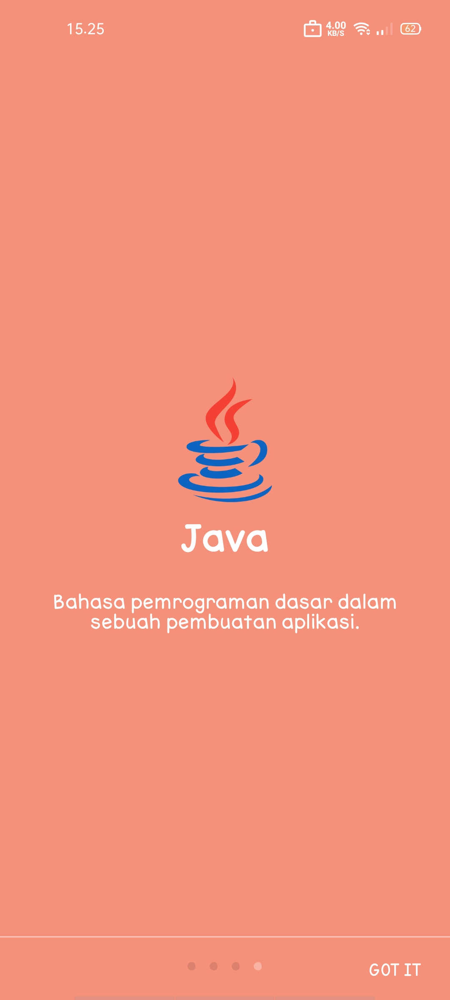
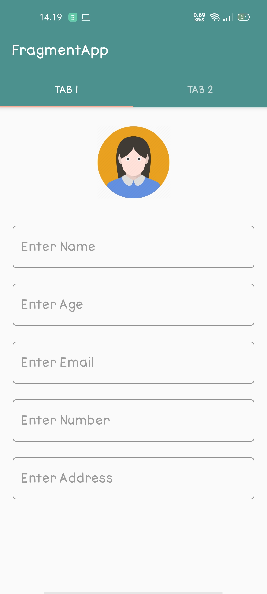
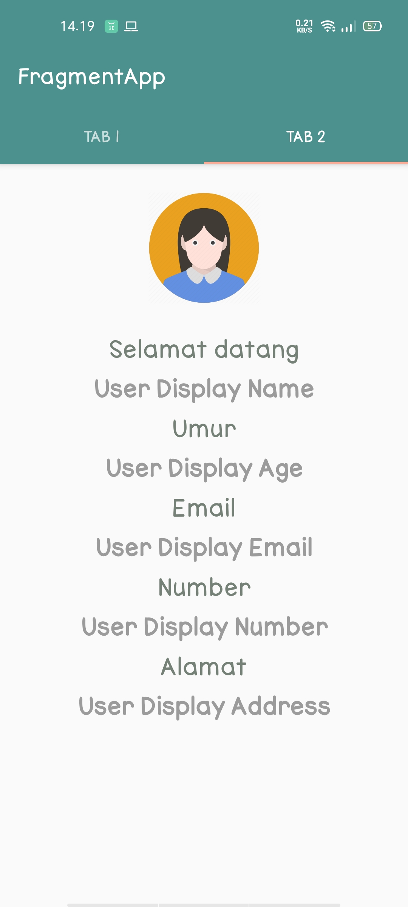
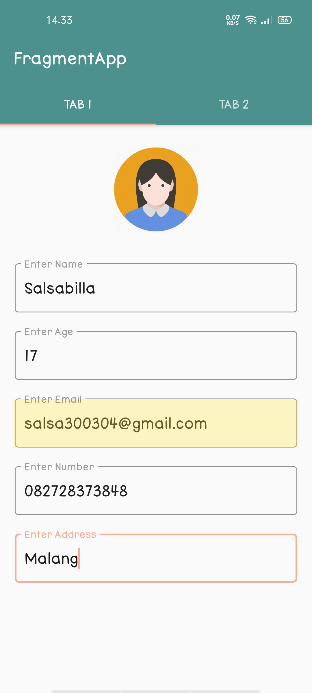
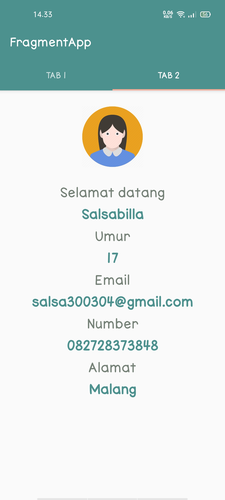

# FragmentApp

A. Fragment

Fragment adalah komponen UI yang mempresentasikan tampilan pada layar. Fragment juga merupakan bagian dari sebuah activity yang mana sebuah fragment tidak akan ada bila tidak ada sebuah activity karena fragment membutuhkan akses dari activity untuk dapat dijalankan.

Kelebihan yang didapatkan bila menggunakan fragment adalah sebagai berikut:

- Tidak perlu memasukkan nama file fragment ke dalam “AndroidManifest” yang diperlukan oleh activity.

- Fungsi yang berada pada activity dapat langsung digunakan dalam fragment tersebut tanpa harus membuat ulang. Contoh: pada saat back, fragment hanya perlu memanggil fungsi “getactivity"

Berikut beberapa poin penting tentang fragment yang perlu untuk kita ketahui, yaitu :

- Fragment dibuat dengan kombinasi file XML Layout dan kelas java seperti Activity.

- Fragment memiliki layout, perilaku, dan life-cyclenya sendiri.

- Fragment dapat di “add” atau “remove” dalam suatu activity saat activity dalam keadaan running.

- Fragment berdiri dan bergantung pada suatu activity dan life-cyclenya dipengaruhi oleh lifecycle activity itu sendiri (Ketika activity pause, fragment juga pause. Ketika activity destroyed, semua fragment akan destroyed)

- Fragment dapat berperilaku seperti activity dalam hal stack. Yaitu dengan penggunaan back stack pada fragment. Fragment baru akan ditambahkan ke stack. Jika kita menekan tombol back, maka akan kembali ke stack fragment yang ditambahkan sebelumnya.
 
  Untuk lebih lengkapnya bisa dilihat [disini](https://medium.com/@reinhardjsilalahi/android-fragment-ee1041a32f65)
  
  # Intro slider
  
  Intro Slider merupakan tampilan beberapa slide yang bisa di geser oleh user sebelum masuk ke menu utama pada sebuah aplikasi atau dengan nama lain Layar Perkenalan Aplikasi. 
  
  Pada Intro slider biasanya memiliki navigasi skip dan next. User juga dapat menavigasi melalui setiap slide menggunakan gerakan mengusap layar HP atau menggunakan tombol next.
  
  # Aplikasi Fragment dan Intro slider
  
  Pada kesempatan kali ini, saya akan membuat aplikasi gabungan antara materi fragment dan intro slider.
  
  Untuk tutorial dapat dilihaat di :
  
  - [Fragment](https://androidwave.com/fragment-communication-using-viewmodel/)
  
  - [Intro slider](https://www.androidhive.info/2016/05/android-build-intro-slider-app/)
  
  
  > ###  Hasilnya seperti berikut :
  
  
  
 > ### Tampilan halaman intro slider :
 
 - Halaman 1
 
 
 
  - Halaman 2
 
 
 
  - Halaman 3
 
 
 
  - Halaman 4
 
 
 
 > ### Tampilan fragment setelah memasuki aplikasi :
 
 - Keika belum diisi 
 
 

 
 
 - Ketika sudah diisi 
 
  
 

  
 
 Pada halaman 2 akan selalu menyesuaikan sesuai dengan halaman 1.
 
 Sekian, Terimakasih :)
 
 # Salsabilla Maurettasya A
 
 # 39 / XI RPL 3
 
 
  
  
  
